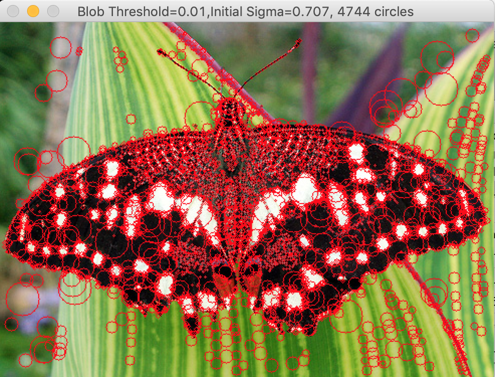

# SIFT-Feature-Detector
Scale Invariant Laplacian Blob Detector for key point detection in images

Here we localize circular patches in a given image using a Laplacian of Gaussian filter and by doing scale-space analysis. 

## How to Run:

Set the variable filelocation in the main() function to the location of the image. It should then run. 

One can also investigate the effect of initial sigma value for LoG filter and thresholding factor by tweaking the below two variables in the code. I varied the parameters in the range as shown below:

initial_sigma= (0.707,1.7)
threshold_factor= (0.006, 0.04)

# Results (more in the imgs folder):

Runtime of the algo: 31.6s on average for processing each image.

  

  

  

By increasing the sigma value we tend to miss out on the finer features while too low sigma value leads to detecting too many local features. Thus, choosing the optimum sigma value depends on the application and the image at hand.

Also,number of detected blobs decrease if we increase the thresholding factor.

